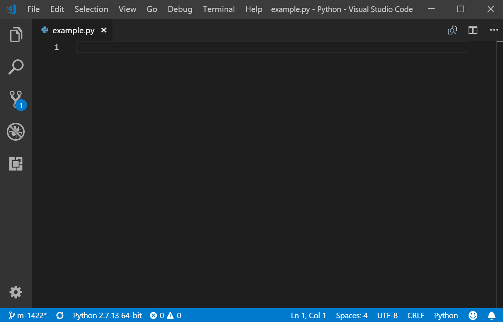

# Derivitec Python Snippets for VS Code

This extension for Visual Studio Code adds snippets for Derivitec Api functions written in Python.

## Usage

Type part of a snippet, press `enter`, and the snippet unfolds.

### App Templates

| Snippet | Purpose              |
| ------- | -------------------- |
| `d-app` | A basic app template |

### Tradables

| Snippet       | Purpose                |
| ------------- | ---------------------- |
| `d-eq-option` | A Equity Option object |

## Requirements

1.  Install Visual Studio Code 1.20.0 or higher
1.  Launch Code
1.  From the command palette `Ctrl`-`Shift`-`P` (Windows, Linux) or `Cmd`-`Shift`-`P` (OSX)
1.  Select `Install Extension`
1.  Choose the extension
1.  Reload Visual Studio Code

## Known Issues

No known issues at this time.

## Release Notes

See the [CHANGELOG](CHANGELOG.md) for the latest changes

